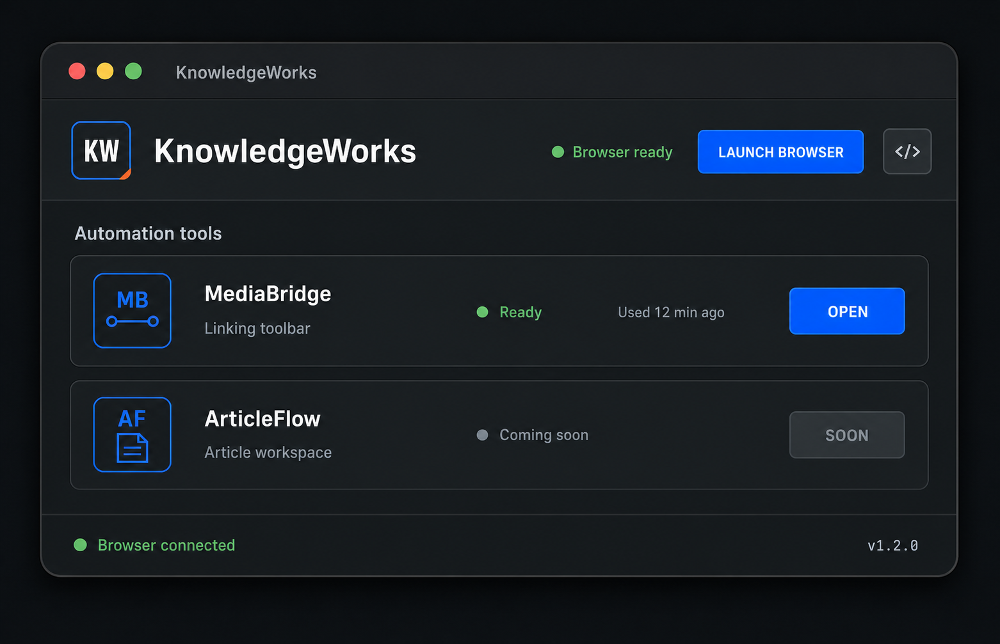

# KnowledgeWorks Design System

## 1. Purpose

This document defines the visual and interaction system for KnowledgeWorks.
Use it when designing, implementing, or reviewing any KnowledgeWorks interface.

KnowledgeWorks is a compact hub for browser-based automation tools. Its design
should feel like dependable professional equipment: precise, efficient, calm,
and distinctive enough to be recognizable without becoming theatrical.

The system is called **Quiet Utility**.

## Visual references

Use the following image to understand the intended visual character, floating
window treatment, cross-background contrast, information density, spacing, and
component hierarchy:



The image is a visual reference only. Do not copy its product names, text, data,
controls, or functionality. When the image conflicts with this document, the
written design-system rules take precedence.

## 2. Design principles

### Utility first

The primary action and current system state must be understandable at a glance.
Decoration must never compete with task completion.

### Operational clarity

Availability, connectivity, progress, success, and failure states must use both
text and visual treatment. Never communicate status with color alone.

### Compact, not cramped

Favor information-efficient layouts with consistent spacing. Secondary detail
should appear progressively instead of crowding the default view.

### Quiet identity

Use clear spacing, regular-width typography, thin separators, calm surfaces,
and restrained brand accents. The interface should recede when idle and become
clear when active.

### Familiar interaction

Buttons, fields, menus, focus states, and disabled controls should behave like
standard desktop and web controls. Visual uniqueness must not reduce usability.

## 3. Visual personality

KnowledgeWorks should feel:

- Precise
- Dependable
- Calm
- Readable
- Native-feeling
- Purposeful
- Slightly unconventional

KnowledgeWorks should not feel:

- Futuristic or cinematic
- Playful or bubbly
- Luxurious or ornamental
- Like a generic analytics dashboard
- Visually noisy

## 4. Color

### Core palette

| Token                   | Value     | Usage                                       |
| ----------------------- | --------- | ------------------------------------------- |
| `color-canvas`          | `#101617` | Main dark application background            |
| `color-surface`         | `#171D1E` | Tool panels and raised dark surfaces        |
| `color-surface-hover`   | `#1D2526` | Hovered dark surfaces                       |
| `color-quiet-surface`   | `#202426` | Default Quiet Utility window surface        |
| `color-quiet-header`    | `#282D2F` | Quiet Utility command header                |
| `color-header`          | `#F2EDE2` | Warm light command header                   |
| `color-floating-header` | `#E8E2D7` | Floating-window command surface             |
| `color-primary`         | `#0757E8` | Primary actions and active accents          |
| `color-primary-hover`   | `#1768F2` | Primary action hover                        |
| `color-primary-pressed` | `#0647BF` | Primary action pressed state                |
| `color-accent`          | `#F05A16` | Registration marks and focused emphasis     |
| `color-success`         | `#44D487` | Connected, ready, and healthy states        |
| `color-warning`         | `#F2B94B` | Delayed or attention-needed states          |
| `color-danger`          | `#F05D62` | Failed, disconnected, or destructive states |
| `color-text-dark`       | `#151A1B` | Primary text on light surfaces              |
| `color-text-light`      | `#F4F2EC` | Primary text on dark surfaces               |
| `color-text-muted`      | `#B4B8B5` | Descriptions and metadata                   |
| `color-text-disabled`   | `#747A7B` | Disabled labels                             |
| `color-border`          | `#485052` | Default panel and control borders           |
| `color-border-subtle`   | `#303839` | Low-emphasis separators                     |
| `color-focus`           | `#6EA0FF` | Keyboard focus ring                         |

### Color rules

- Use cobalt for the single most important available action in a region.
- Use orange for small accents, focus markers, or registration details. Do not
  use it as a large background.
- Reserve green, amber, and red for semantic status.
- Pair every semantic color with a label or icon.
- Maintain a minimum contrast ratio of 4.5:1 for normal text and 3:1 for large
  text and meaningful interface graphics.
- Do not introduce purple gradients or decorative multicolor gradients.

### CSS token reference

```css
:root {
  --kw-font-sans: 'Inter', system-ui, sans-serif;
  --kw-font-mono: 'IBM Plex Mono', ui-monospace, monospace;
  --kw-canvas: #101617;
  --kw-surface: #171d1e;
  --kw-surface-hover: #1d2526;
  --kw-quiet-surface: #202426;
  --kw-quiet-header: #282d2f;
  --kw-header: #f2ede2;
  --kw-floating-header: #e8e2d7;
  --kw-primary: #0757e8;
  --kw-primary-hover: #1768f2;
  --kw-primary-pressed: #0647bf;
  --kw-accent: #f05a16;
  --kw-success: #44d487;
  --kw-warning: #f2b94b;
  --kw-danger: #f05d62;
  --kw-text-dark: #151a1b;
  --kw-text-light: #f4f2ec;
  --kw-text-muted: #b4b8b5;
  --kw-text-disabled: #747a7b;
  --kw-border: #485052;
  --kw-border-subtle: #303839;
  --kw-focus: #6ea0ff;
}
```

## 5. Typography

### Type families

- **Primary:** Inter, system-ui, sans-serif
- **Fixed-width metadata:** IBM Plex Mono, ui-monospace, monospace

Use Inter for the wordmark, headings, names, descriptions, buttons, statuses,
navigation, and everyday content. Inter is the default font across every
KnowledgeWorks interface. Use monospace only for versions, code, and values
where fixed-width alignment materially improves scanning.

### Type scale

| Role          | Size / line height | Weight | Notes                          |
| ------------- | ------------------ | ------ | ------------------------------ |
| App wordmark  | `24px / 30px`      | 650    | Inter; title case              |
| Tool name     | `18px / 24px`      | 600    | Inter                          |
| Section label | `14px / 20px`      | 600    | Inter; sentence case           |
| Body          | `15px / 22px`      | 400    | Default descriptive copy       |
| Button        | `14px / 20px`      | 600    | Inter; concise label           |
| Metadata      | `13px / 18px`      | 400    | Inter; muted                   |
| Status chip   | `12px / 16px`      | 500    | Inter; sentence case           |
| Footer        | `13px / 18px`      | 500    | Status and version information |

### Typography rules

- Use sentence case for headings, descriptions, statuses, and metadata.
- Uppercase is optional only for very short primary actions where it improves
  scanning. Do not use it as the default interface voice.
- Do not use condensed typefaces.
- Avoid font weights below 400 on dark backgrounds.
- Truncate only when the full label is available through a tooltip or detail
  view.

## 6. Spacing and sizing

Use a base spacing unit of `4px`, with most layout decisions aligned to an
`8px` rhythm.

| Token      | Value  |
| ---------- | ------ |
| `space-1`  | `4px`  |
| `space-2`  | `8px`  |
| `space-3`  | `12px` |
| `space-4`  | `16px` |
| `space-5`  | `20px` |
| `space-6`  | `24px` |
| `space-8`  | `32px` |
| `space-10` | `40px` |

Recommended control heights:

- Compact icon button: `40px`
- Standard button: `44px`
- Search or filter field: `44px`
- Status chip: `28–32px`
- Tool row: `112–144px`, depending on available metadata

Use `24px` page or window padding on desktop and `16px` on compact layouts.

## 7. Shape, borders, and elevation

### Corners

- Floating window shell: `18–24px`, following the host platform.
- Large non-floating workspace shell: up to `32px`.
- Standard controls: `8px`.
- Tool panels: `10–12px`.
- Status chips: `6px`.
- Avoid pill shapes except for very short status indicators when space is
  constrained.

### Borders

- Default border: `1px solid var(--kw-border)`.
- Subtle separator: `1px solid var(--kw-border-subtle)`.
- Selected or active border: cobalt.
- Error border: danger red.

### Shadows

Use shadows to distinguish a floating application window from the page beneath
it or to separate a temporary overlay.

```css
box-shadow:
  0 10px 32px rgb(0 0 0 / 40%),
  inset 0 0 0 1px rgb(255 255 255 / 28%);
```

Do not use soft shadows to define every card. Prefer rules, contrast, and
spacing.

### Brand accents

Allowed details include:

- One `2–4px` orange registration mark on a brand mark
- Thin separators between functional regions
- Cobalt outlines for active or branded elements
- Subtle tonal surface changes

Do not use dot-grid textures, clipped corners, decorative technical rules, or
ornamental console details in the default Quiet Utility interface.

## 8. Floating window standard

KnowledgeWorks interfaces may appear as floating desktop windows. Every
floating surface must remain visually distinct over white, dark, colorful, and
visually busy webpages.

### Window boundary

- Use a conventional, continuous rounded rectangle for the outer window.
- Never clip, notch, or interrupt an exterior corner.
- Use an opaque `2px` charcoal perimeter frame.
- Use the floating-window shadow and inner keyline defined above.
- Keep dark side and bottom framing visually continuous.
- Do not change the window palette dynamically based on the webpage beneath it.

This double-boundary treatment must remain visible over both bright and dark
content:

```css
.kw-floating-window {
  position: relative;
  overflow: hidden;
  background: var(--kw-quiet-surface);
  border: 2px solid var(--kw-border-subtle);
  border-radius: 20px;
  box-shadow:
    0 10px 32px rgb(0 0 0 / 40%),
    inset 0 0 0 1px rgb(255 255 255 / 28%);
}
```

Do not use transparency, backdrop blur, or glass effects for the primary window
surfaces. The tool must not visually merge with the webpage underneath it.

### Electron title and drag regions

- Provide a clear, predictable drag region in unused header space.
- Keep every interactive element outside the drag region.
- Apply `-webkit-app-region: drag` to the intended drag surface.
- Apply `-webkit-app-region: no-drag` to buttons, fields, links, menus, and
  other interactive descendants.
- Do not place important text or status information in the only practical drag
  area.

```css
.kw-window-drag-region {
  -webkit-app-region: drag;
}

.kw-window-drag-region button,
.kw-window-drag-region a,
.kw-window-drag-region input,
.kw-window-drag-region select,
.kw-window-drag-region textarea,
.kw-window-control {
  -webkit-app-region: no-drag;
}
```

### Window controls

- Keep close, minimize, code, pin, and other window-level controls at least
  `16px` from the nearest outer edge.
- Maintain at least `8px` between adjacent controls.
- Use a minimum `40px` icon-button size and a `44px` target whenever the window
  dimensions allow it.
- Give the close control a restrained danger-color hover or focus outline.
  Avoid a permanently filled red button.
- Preserve familiar platform order and icon meaning.

### Internal brand details

Keep brand details small and away from drag boundaries, resize edges, and
window controls.

Use at most:

- One small orange registration mark per window
- One cobalt outline or selected treatment per region
- Thin separators where they improve hierarchy

### Surface hierarchy

- Use `color-quiet-surface` as the default floating-window surface.
- Use `color-quiet-header` for a slightly elevated command header.
- Use `color-floating-header` for light floating command surfaces.
- Use `color-canvas` or `color-surface` for status strips and operational
  regions.
- Reserve cobalt for the active action.
- Keep surfaces fully opaque.
- Light mode may use `color-header` or `color-floating-header`; dark Quiet
  Utility is the default visual reference.

### Floating states

- If the user can toggle always-on-top behavior, communicate the active state
  with a labeled tooltip and a persistent selected treatment.
- Provide a compact or collapsed mode for tools intended to remain onscreen for
  long periods.
- Preserve the same boundary, shadow, and control rules in every window size.
- Do not reduce text or controls below accessibility minimums to create a
  smaller mode.

### Contrast validation

Review every floating window over:

1. A plain white page
2. A near-black page
3. A saturated or photographic page
4. A visually dense page with text and controls

The window boundary, primary action, window controls, status text, and focus
indicators must remain immediately recognizable in every case.

## 9. Layout

### Compact desktop utility

The default KnowledgeWorks window uses three regions:

1. **Command header:** identity, browser state, and utility controls
2. **Automation tools:** the primary working area
3. **Status footer:** connection state and version

Preserve this hierarchy unless the product grows beyond a compact utility.

### Tool list

- Use one horizontal row per tool.
- Keep the icon, identity, status, metadata, and primary action aligned.
- Maintain a consistent action position across rows.
- Show only essential state by default.
- Put diagnostics and historical metrics in expandable details.

### Responsive behavior

Below `720px`:

- Stack metadata below the tool description.
- Keep the primary action visible without horizontal scrolling.
- Reduce outer padding to `16px`.
- Allow the tool action area to move to its own row.
- Preserve a minimum `44px` touch target.

Do not shrink text below the defined scale to force content into one row.

## 10. Components

### Application header

Contains:

- KW monogram
- KnowledgeWorks wordmark
- Browser status
- Optional utility or developer control

The browser status should read as system state, not as a second primary action.
Examples: `Browser ready`, `Connecting`, and `Disconnected`.

### Section heading

Use Inter semibold in sentence case. Separate the heading from nearby content
with spacing rather than ornamental rules.

Example: `Automation tools`

### Tool panel

Required content:

- Recognizable icon or two-letter monogram
- Tool name
- One-line description
- Availability or execution status
- Primary action

Optional content:

- Friendly last-used time
- Favorite control
- Expandable details
- Progress indicator

Tool panels should not expose run counts, success rates, raw timestamps, or
diagnostic data unless the user requests details.

### Primary button

- Cobalt background
- Light text
- Minimum `44px` height
- Clear verb such as `OPEN`, `RUN`, or `LAUNCH BROWSER`
- One primary action per tool or region

States:

- Hover: lighter cobalt
- Pressed: darker cobalt
- Focus: `2px` focus ring with `2px` offset
- Disabled: dark neutral surface and muted text
- Loading: preserve button width and show progress without changing the label
  unexpectedly

### Secondary and icon buttons

Use a transparent or dark surface with a visible border. Every icon-only button
must have an accessible name and a tooltip on hover or focus.

### Status chip

Use a border, semantic dot, and explicit label.

| Status            | Treatment                              |
| ----------------- | -------------------------------------- |
| `Ready`           | Green dot and green text               |
| `Running`         | Cobalt dot, label, and nearby progress |
| `Needs attention` | Amber dot and label                    |
| `Failed`          | Red dot and label                      |
| `Coming soon`     | Neutral border and muted text          |
| `Disconnected`    | Red dot and label                      |

### Footer status

Place connection state on the left and version information on the right.
Use a semantic dot plus readable text such as `Browser connected`.

## 11. Icons

- Use simple outlined icons with a consistent `1.5–2px` stroke.
- Prefer geometric, functional symbols.
- Keep icon sizes to `16px`, `20px`, or `24px`.
- Tool identity marks may use `40–56px` containers.
- Do not mix filled, outlined, and illustrative icon styles in one view.
- Do not rely on an icon alone for unfamiliar actions.

## 12. Interaction and motion

Motion should confirm state changes rather than decorate the interface.

| Interaction      | Duration    | Easing   |
| ---------------- | ----------- | -------- |
| Hover and focus  | `120ms`     | ease-out |
| Panel expansion  | `180ms`     | ease-out |
| Modal or overlay | `180–220ms` | ease-out |
| Progress         | Continuous  | linear   |

Respect `prefers-reduced-motion`. Disable nonessential movement when requested.
Do not use parallax, bouncing, or looping ambient animation.

## 13. Content style

- Use short, direct labels.
- Prefer verbs for actions: `Open`, `Run`, `Connect`, `Retry`.
- Use friendly relative time: `Used 12 min ago`, not a raw UTC timestamp.
- Explain disabled actions when the reason is not obvious.
- Keep descriptions to one concise line when possible.
- Use `Coming soon` only when the feature is genuinely planned.

## 14. Accessibility

- Meet WCAG 2.2 AA contrast requirements.
- Provide a visible keyboard focus indicator on every interactive element.
- Maintain a minimum target size of `44 × 44px`.
- Support keyboard navigation in logical visual order.
- Use semantic HTML controls instead of clickable generic containers.
- Announce connection, execution, success, and error changes to assistive
  technology.
- Never communicate state by color alone.
- Do not disable zoom or text scaling.

## 15. Approved patterns

- Calm graphite surfaces with subtle tonal hierarchy
- Inter used consistently across the interface
- One cobalt action per region
- Compact, labeled semantic statuses
- Horizontal tool panels with consistent action alignment
- Friendly time labels
- Progressive disclosure for diagnostics
- Thin borders and restrained brand detail
- Opaque floating surfaces with a continuous charcoal perimeter
- Conventional outer geometry

## 16. Prohibited patterns

- Purple or decorative gradients
- Glassmorphism
- Oversized hero controls inside the utility window
- Bubbly cards or excessive pill shapes
- Heavy shadows on every component
- Unlabeled icon buttons
- Raw technical metrics in the default tool list
- More than one visually dominant action per region
- Decorative sci-fi interface elements
- Tiny low-contrast metadata
- Additional colors outside the token system without documented need
- Clipped, notched, or interrupted exterior window corners
- Transparent floating-window surfaces
- Window controls placed against resize edges
- Interactive controls included in an Electron drag region
- Condensed typefaces
- Dot-grid textures
- Clipped internal panel corners
- Decorative console or technical motifs

## 17. Implementation checklist

Before considering a KnowledgeWorks interface complete, verify:

- [ ] Only documented color tokens are used.
- [ ] The primary action is immediately identifiable.
- [ ] Every operational state has a text label.
- [ ] Tool actions align consistently.
- [ ] Disabled actions explain their state when necessary.
- [ ] Keyboard focus is visible.
- [ ] Normal text meets 4.5:1 contrast.
- [ ] Controls meet the minimum target size.
- [ ] Relative timestamps are used for everyday activity.
- [ ] Inter is used for all interface typography except approved fixed-width
      metadata.
- [ ] Headings, statuses, and metadata use sentence case by default.
- [ ] Brand decoration remains subtle.
- [ ] The layout works without horizontal scrolling at supported widths.
- [ ] Reduced-motion preferences are respected.
- [ ] Floating surfaces are fully opaque.
- [ ] The outer window is a continuous rounded rectangle.
- [ ] The charcoal frame and shadow separate the window from light and dark
      webpages.
- [ ] Window controls have a safe edge inset and adequate target size.
- [ ] Electron drag and no-drag regions are correctly assigned.
- [ ] Dot grids, clipped corners, and decorative console motifs are absent.
- [ ] The window has been reviewed over white, dark, photographic, and dense
      backgrounds.

## 18. Governance

Reuse existing tokens and components before adding new ones. Any new token or
component variant must solve a recurring product need, not a one-off visual
preference.

When an implementation conflicts with this document:

1. Preserve usability and accessibility.
2. Flag the conflict during review.
3. Update this document if the product decision establishes a new reusable
   pattern.

Do not silently diverge from the system.
